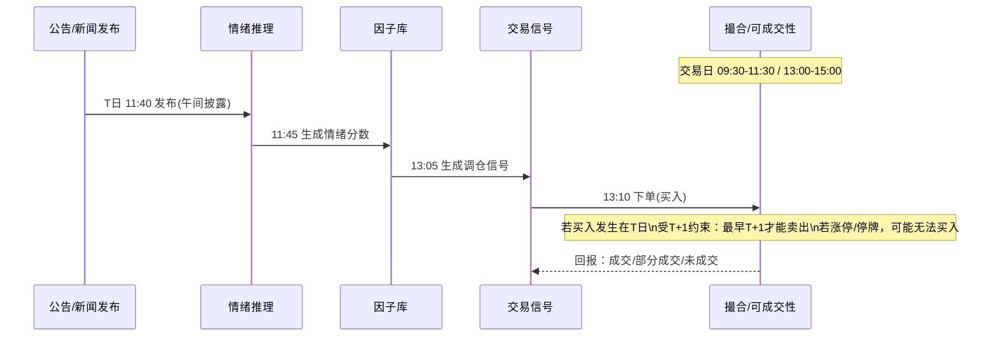
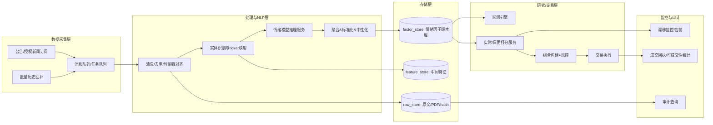

# 在因子评分体系中引入基于 AI 的新闻情绪因子：面向 A 股量化策略工程师的可执行研究报告草案

## 执行摘要

全球学术与行业研究普遍支持“文本信息（新闻/公告/社交媒体）所蕴含的情绪/语调”对股票收益与风险具有可观测的预测相关性，但这种信息优势往往高度依赖**数据来源质量、事件时间戳对齐、样本外稳健性与交易约束可实现性**。经典研究显示媒体语调与市场回报存在系统性关系，且存在“旧闻/转载（stale news）”带来反转型效应的证据，这意味着**去重与“新颖度”建模**是把情绪信号工程化为因子的关键环节之一。citeturn2search29turn15search13turn15search4turn15search9

在 A 股制度约束下，是否“值得”把 AI 新闻情绪因子纳入现有因子评分体系，取决于你策略的**目标频率（未指定）**与**可交易性约束（T+1、涨跌停、停牌）**对信号兑现窗口的压缩程度。若你的策略偏**日频/周频选股与调仓**（更符合 T+1 约束），情绪因子更可能提供增量信息；若你的策略偏**日内**，则必须把公告披露时点与撮合可用性做精确建模，否则容易出现“回测看似有效、实盘不可成交”的伪 α。上交所/深交所对涨跌幅限制、披露时段等规则是可直接从制度文本确认的硬约束，不依赖你的代码；但“情绪因子是否在你现有因子体系中带来显著增量 IC/净收益”必须在你的本地数据与回测框架中验证。citeturn22view1turn21view2turn13search8turn19search0

建议采用“**三阶段路线**”：  
第一阶段先做**离线研究（历史回测）**，数据源优先“交易所/指定披露渠道公告 + 合规授权新闻源”；模型优先“中文预训练模型 + 金融语料再预训练/微调”的轻量可控路线；因子以**日更**为主，严格防信息泄露与去重。第二阶段在通过 Purged/CPCV、DSR/PBO、Reality Check 等抗过拟合检验后再做**准生产日更上线**。第三阶段（可选）再扩展到**准实时/分钟级**，但只有在你明确具备数据授权、低延迟基础设施、以及对 T+1/涨跌停可交易性已做撮合级仿真的前提下才建议推进。citeturn11search3turn16search0turn16search1turn16search2turn13search21

下表给出“优先级清单（摘要版）”，并明确哪些项需要本地回测验证（✅）：

| 优先级 | 改进项 | 为什么重要 | 依赖未指定项 | 必须本地回测验证 |
|---|---|---|---|---|
| P0 | 合规数据源与授权边界确定（公告/新闻/UGC） | 数据授权与平台条款决定可持续性；不合规抓取风险高 | 你是否有 Wind/同花顺/东方财富等授权；是否自建爬虫 | ❌（合规边界可直接由条款/合同确定，但“可用性”需工程验证） |
| P0 | 时间戳对齐（公告披露时段→可交易时刻）+ T+1/涨跌停撮合仿真 | 情绪因子最常见的回测偏差来源 | 目标频率；撮合模型；是否允许日内买入 | ✅ |
| P1 | 去重/新颖度（stale news）建模 | 转载与重复会放大噪声并改变收益反应结构 | 你使用的新闻聚合源结构 | ✅ |
| P1 | 模型路线：中文 LM（BERT/ERNIE/wwm）+ 金融语料再预训练/微调 | 在有限标注下更稳健；工程可控 | 你能否构建标注集/弱标签 | ✅ |
| P2 | 情绪→因子：实体级聚合 + 行业/市值中性化 + winsorize/z-score | 更接近传统因子体系口径，便于组合构建 | 你的行业分类/风险模型口径 | ✅ |
| P2 | 上线：日更批处理 + 因子库/审计日志/漂移监控 | 生产可维护性与可追责 | 你的部署环境与合规要求 | ✅（主要是工程验收） |

citeturn15search13turn20search2turn13search8turn19search0turn16search0turn16search1

---

## 数据源与合规边界

### 数据源选择的“合规优先级”原则

在中国市场，上市公司依法披露的信息应在证券交易所网站与符合监管条件的媒体发布，且信息披露义务人不得以新闻发布、答记者问等替代法定义务；因此，**交易所/指定披露渠道公告**通常是构建“新闻情绪因子”的最低合规风险底座。citeturn13search11turn13search8

与之相对，资讯聚合网站与社交平台往往通过用户协议或服务条款限制抓取、复制与再传播；部分平台服务协议明确禁止使用爬虫等方式批量访问与抓取内容。若你计划将“雪球/微博/微信公众号”等作为情绪数据源，需要特别关注：  
1) 平台条款限制（抓取与再利用）；2) 是否涉及个人信息处理；3) 是否存在“舆情操纵/谣言传播”引发的策略尾部风险与合规审计风险。citeturn5search1turn8search8turn6search4turn15search26

与 OpenAPI 合作相关的司法与合规讨论中，“平台授权 + 用户授权 +（必要时）再次用户授权”的多重授权原则被反复强调（尤其在涉及用户数据的场景）；这意味着即便通过平台 API 获取数据，也需要严格遵守开发者协议规定的用途、范围与留存规则。citeturn5search6turn5search3turn5search0

### 数据源清单表（覆盖、可获取性、难度与合规备注）

> 说明：以下“免费/付费/延迟”按公开信息一般形态归类；具体价格、延迟与权限以你与数据提供方合同/账户权限为准（未指定）。对“抓取难度”的评价是工程复杂度与反爬门槛的综合估计；对“合规风险”的评价主要依据公开服务条款/监管规则的方向性提示，并非法律意见。citeturn13search11turn5search1turn8search8turn12search0

| 数据源 | 可获取性（免费/付费/延迟） | 覆盖范围（内容/市场） | API/抓取难度 | 合规风险要点（内幕/舆情/条款） | 工程建议用途 |
|---|---|---|---|---|---|
| entity["organization","上海证券交易所","stock exchange, shanghai, cn"]披露与规则（网站/披露时段/交易规则） | 免费（网页）；披露按规则时段 | 公告披露、交易制度规则；A 股（含科创板规则） | 抓取难度低-中（网页/下载）；需尊重站点规则 | 披露时段、交易规则可直接作为“可交易性约束”输入；公告属于依法披露信息，但仍需遵守网站使用规则与版权 | 作为公告“权威时间戳”与制度约束来源；用于对齐与撮合约束建模 |
| entity["company","上证所信息网络有限公司","sse info network, cn"]（上交所公告服务） | 免费（查询/订阅形态）；是否限流视服务而定 | 上交所公告检索、订阅、流水查询等 | 难度低-中（公开检索接口形态；需工程验证限流） | 以公开披露公告为主，相对低风险；仍需遵守服务条款与访问频率 | 优先作为“公告正文+附件 PDF”抓取入口之一，并保留原始链接与发布时间 |
| entity["organization","深圳证券交易所","stock exchange, shenzhen, cn"]披露入口（网站） | 免费（网页） | 公告披露入口、规则与指南；深市主板/创业板相关制度 | 抓取难度低-中 | 规则与披露口径用于时间对齐；与交易规则一致性约束 | 作为深市披露入口与制度约束来源 |
| entity["organization","巨潮资讯网","listed disclosure portal, cn"]（指定信息披露网站体系的一部分） | 免费检索为主；大量调用可能受限 | 沪深上市公司公告、定期报告/临时公告 PDF | 抓取难度中（常见反爬/参数） | 需关注访问频率/条款；公告本身公开，但批量下载与再分发存在权利边界 | 作为公告历史库的重要来源；建议做“增量订阅+缓存+去重”而非高频全量爬取 |
| entity["company","深圳证券信息有限公司","market data provider, cn"] +“深证信数据服务平台”（webapi） | 付费/授权为主（平台化 API） | 市场数据与信息服务（以其授权范围为准） | API 难度中（鉴权/配额） | 走授权路径风险更可控；避免逆向/非授权调用 | 如你已有合同与 Key，适合作为稳定数据源替代爬虫 |
| Wind（WDS/WAPI 等） | 付费；延迟/权限分层 | 全市场数据、新闻/研报/公告整合、因子与事件等（以权限为准） | API 难度中（官方 SDK/鉴权） | 合同约束强、合规路径清晰；注意用途限制与审计要求 | 若你已订阅，优先用作“统一主数据 + 新闻/公告聚合”以降低工程与合规成本 |
| 同花顺（iFinD） | 付费；延迟/权限分层 | 金融数据与资讯（以产品权限为准） | API 难度中 | 合同与条款约束；避免非授权抓取 | 作为新闻/公告/研报的一体化数据源候选（若已有授权） |
| 东方财富（Choice 量化接口） | 付费/授权形态；可能提供资讯订阅/推送能力 | 数据与资讯接口（以手册与权限为准） | API 难度中 | 使用需满足产品授权与条款；避免绕过授权 | 适合做“资讯订阅→消息队列→情绪推理”日更或准实时链路 |
| 传统媒体网站（转载聚合） | 多为免费阅读；商业化抓取风险高 | 宏观与行业新闻、个股新闻（转载多） | 抓取难度中-高（反爬/版权） | 版权/反不正当竞争风险；“全文再利用”风险显著 | 不建议作为核心源；可做“标题级/摘要级”辅助并做相似度去重 |
| 雪球（UGC/讨论） | 免费阅读；平台协议限制抓取 | 投资者讨论、情绪、话题热度 | 抓取难度高（动态接口/限流） | 服务协议明确限制爬虫抓取；UGC 还可能涉及个人信息与操纵内容 | 若无授权，不建议生产使用；研究阶段也应严格控制频率并评估合规替代方案 |
| 微博（UGC/舆情） | 官方接口需开发者体系；免费/付费分层 | 舆情扩散、话题热度、情绪表达 | API 难度中；抓取风险高 | 内容与数据权利归平台及相关权利人；API 使用需遵守协议；涉及用户数据需谨慎 | 更适合做“宏观情绪/热点风险监控”而非直接做日频选股因子 |
| 微信公众号（媒体/自媒体） | 面向账号主体的接口为主；公开抓取风险高 | 深度解读、行业观点 | 抓取难度高（强反爬/封禁风险） | 平台对数据违规采集、外挂/插件等治理趋严；难形成稳定合规管道 | 不建议作为核心生产源；可通过合规资讯商间接获取 |
| 财新（专业媒体） | 订阅/付费服务；商业使用受协议约束 | 高质量财经新闻/数据服务（以订阅为准） | API/数据服务多为付费；抓取不建议 | 服务条款强调知识产权与内容使用限制 | 若你有“财新数据”付费服务与授权，用作高质量新闻源；否则不建议抓取 |
| 澎湃（媒体） | 免费阅读为主；商业化抓取风险高 | 时政/财经/社会新闻与评论 | 抓取难度中-高 | 需关注版权与不正当竞争边界；新闻数据批量使用存在争议案例空间 | 不建议作为核心生产源；若使用，建议只用“标题+时间+链接”并做最小必要原则 |

citeturn3view1turn4search0turn4search6turn23view2turn23view3turn5search1turn6search4turn5search22turn12search0turn8search8

### A 股制度与信息披露时点对情绪因子的“硬约束”

上交所明示交易日增加早间、午间披露时段（例如早间 7:30-8:30、午间 11:30-12:30）以及非交易日披露时段（13:00-17:00）的安排；深交所亦存在“直通车”披露在不同提交时间对应自动发送披露的机制差异。对量化回测而言，这意味着“公告发布时间戳”不是一个简单的日期字段，而是决定你能否在当日/次日建立持仓的关键变量。citeturn13search8turn13search21

另外，涨跌幅限制会导致“利好/利空新闻”在同一交易日触发涨跌停，从而让理论上可赚取的收益在实盘中因为**无法成交/无法卖出**而不可实现；科创板竞价交易涨跌幅比例 20%，且新股上市后前 5 个交易日不设涨跌幅限制等制度条款，都会显著改变“新闻冲击→可交易收益”的传导路径，必须在撮合仿真中体现。citeturn22view1turn18search0turn22view1turn21view2

---

## 情绪分析方法综述与选型

### 方法选择的工程化评价维度

面向“加入因子评分体系”的目标，情绪分析方法不应只看 NLP 指标（Accuracy/F1），更应以“**可交易预测性**”为终极评价：信息系数（IC/RankIC）、因子收益/回撤、换手与成本敏感性、以及样本外稳定性（Purged/CPCV + 多重检验校正）共同决定是否值得上线。citeturn11search3turn16search0turn16search2turn20search0

### 情绪分析方法综述表（含代表论文/实现与 A 股适配建议）

| 方法类别 | 典型做法 | 优点 | 局限 | 代表性论文/资源 | 对 A 股适配建议 |
|---|---|---|---|---|---|
| 词典法/语调计数 | 以词典统计“正/负/不确定”等词频，构造语调分数 | 可解释、计算便宜、冷启动快 | 对否定/讽刺/歧义敏感；跨语域迁移差 | Loughran–McDonald 金融语调词典及其更新研究citeturn2search32turn2search36 | 适合作为 baseline 与解释层；中文需自建金融词典或用弱监督扩展，避免单靠分词词频 |
| 传统 ML（BoW/TF-IDF + LR/SVM/SVR） | 文本向量化→分类/回归（如 [-1,1] 强度） | 对小数据相对稳健；训练推理快 | 特征工程重；对语义/上下文有限 | SemEval-2017 Task5 与 FiQA 系列基线方法中常见 SVR/SVM 路线citeturn9search2turn9search9turn9search14 | 若你只做“标题级情绪”，可用作低成本方案；需配合去重与实体映射 |
| 深度学习（CNN/RNN） | 字/词序列模型做分类/回归 | 能学习一定上下文；较 BoW 强 | 训练依赖标注；迁移弱于预训练 LM | 作为过渡路线在金融情绪任务中出现，但主流已转向预训练 LMciteturn15search4turn9search12 | 不建议作为长期主力；除非你已有成熟标注与训练基础设施 |
| 预训练语言模型（BERT 系） | 中文 BERT/ERNIE/RoBERTa 等微调情绪分类或强度回归 | 语义表示强；少量标注也能较好迁移 | 推理成本更高；仍需领域适配与数据治理 | BERT 原论文；RoBERTa；ERNIE；中文 whole word masking 等citeturn10search0turn10search1turn10search2turn10search3 | 推荐“中文 LM + 金融语料再预训练/微调”；重点处理财经专名（公司简称、公告术语） |
| 金融领域微调/继续预训练（FinBERT 思路） | 先在金融大语料继续预训练，再在情绪数据集微调 | 显著提升金融语境下情绪识别 | 需要金融语料与训练资源；版权与授权需处理 | FinBERT（金融语料预训练 + PhraseBank 微调）citeturn9search36turn9search4 | 在中文可复刻同思路：用你的合规新闻/公告语料做继续预训练；再微调到中文金融情绪标注 |
| 事件抽取 + 实体级情绪聚合（ABSA/NER） | 识别实体（公司/产品/高管/事件）→对实体做情绪与强度→按股票聚合 | 更贴近“个股因子”；能处理“一文多股/多事件” | NER/实体链接难；需要词典/知识库 | FiQA 的 aspect-based 思路与 ABSA 研究综述citeturn9search5turn9search3turn9search19 | 强烈建议用于公告与研报：先做“公司实体链接→实体情绪”以降低噪声；A 股简称映射要维护 |
| 多语言迁移（mBERT/XLM-R + 翻译） | 用多语模型跨语训练或先翻译到统一语种 | 可覆盖外媒英文新闻；便于统一模型 | 翻译误差；速度与成本；金融专名易错译 | XLM-R 等跨语表示学习citeturn11search0 | 若你纳入外媒（彭博/路透英文源），可用 XLM-R 或先翻译后再中文模型；必须做实体一致性校验 |
| LLM 提示/小样本推理（Prompting） | 用指令/示例让大模型输出情绪/事件标签 | 冷启动强；可做弱标注生成 | 成本与延迟大；输出漂移；合规与可解释性挑战 | 金融情绪任务中对 LLM 适配的研究与基准工作citeturn9search12turn9search8 | 更适合“离线弱标注/生成训练集”，生产端建议蒸馏到小模型以控成本与稳定性 |

citeturn10search0turn9search36turn9search2turn11search0turn15search4

### 与“因子评分体系”对接时的选型结论（可直接从文献得到 vs 需本地验证）

可直接从文献与行业实践得到的结论是：金融语境下，单纯情绪分类往往不足以稳定交易，必须把“来源质量、时序、去重、实体聚合、以及稳健验证框架”纳入整体系统；尤其“转载/旧闻”会改变收益反应结构，因此对重复内容做相似度去重或新颖度加权是必要的工程步骤。citeturn15search13turn15search4turn9search36

必须在你的本地数据/策略代码上回测验证的部分包括：哪类文本源（公告 vs 新闻 vs UGC）在你的股票池与调仓频率下提供最高增量 IC；情绪聚合窗口（1D/3D/5D/10D、EMA 半衰期等）的最优选择；情绪因子与现有因子（动量、波动、流动性、质量等）的相关性与“边际贡献”（增量解释与增量收益）。citeturn11search3turn20search2turn15search9

---

## 情绪因子构建流程与防信息泄露

### 可执行的端到端流程（步骤表：输入/输出/参数/可配置项）

> 设计目标：把“文本→情绪→股票横截面因子”变成可复现、可审计、可回测、可上线的流水线；每个环节都要显式标注**可配置项**与**泄露防护点**。citeturn13search11turn11search3turn20search2

| 步骤 | 输入 | 输出 | 关键参数/可配置项 | 滞后与泄露防护要点 | 需本地回测验证 |
|---|---|---|---|---|---|
| 数据获取与授权登记 | 数据源清单、授权/条款、抓取策略 | source_id、license_tag、采集配额 | 源优先级（公告>授权新闻>UGC）；采样频率；字段最小化 | 合规先行：UGC 若无授权不进入生产；记录条款版本与采集策略 | 否（合规边界）/是（数据可得性与覆盖影响回测） |
| 原始落库（不可变） | 原始 HTML/PDF/文本、抓取时间、来源 URL | raw_store（hash、正文、附件） | 存储格式（WARC/Parquet/PDF）；保留原始 hash | 保留“抓取时间”与“原文发布时间”两套时间戳；任何下游都以“发布时间→可交易时刻”派生 | 否（工程） |
| 时间戳标准化 | 原文发布时间字段、时区、交易日历 | event_ts（统一到北京时间）、event_trading_day | 交易日历；时区；盘前/盘中/盘后规则映射 | 用交易所披露时段规则确定“可用时刻”；避免用“网页入库时间”替代发布时间 | 是（对收益归因影响巨大） |
| 去重与新颖度计算 | 文本、标题、来源、实体 | duplicate_flag、novelty_score | 相似度阈值；窗口（过去 N 篇/过去 N 天）；MinHash/embedding | 避免转载重复放大；可参考“文本相似度定义陈旧度”的学术做法 | 是 |
| 文本预处理 | 原文文本 | 清洗后 token/句子 | 中文分词/字粒度；去噪规则；数字/金额规范化 | 预处理只能使用当时可得信息；不得引入未来字典/未来知识库版本（需版本化） | 是 |
| 实体识别与股票映射 | 文本、公司名称库、证券代码表 | {ticker: mention_list} | NER 模型；别名表；歧义消解策略 | 公司简称/子公司/品牌名必须映射；映射失败的文本不能“默认归因” | 是 |
| 情绪打分（句/文档/实体） | 预处理文本 + 模型 | sentiment_raw（-1~1 或 logits） | 模型类型；阈值；强度回归 vs 分类 | 模型版本锁定；推理只用事件时刻可得文本 | 是 |
| 按股票聚合 | {ticker: sentiment_raw, novelty} | sentiment_stock_t,w | 窗口：1D/3D/5D/10D；EMA 半衰期；权重（来源/新颖度/长度） | 聚合窗口必须以“可交易时刻”切片；避免把 T+1 之后的新闻算进 T 日因子 | 是 |
| 标准化与中性化 | sentiment_stock_t,w + 截面特征（行业/市值等） | sentiment_factor_t（z-score） | winsorize 阈值（如±3σ）；行业/市值中性化口径 | 使用当期行业分类与市值；对极端值 winsorize，再做 z-score | 是 |
| 滞后与撮合约束 | sentiment_factor_t + 交易规则 | tradable_factor_t (shifted) | lag 方案；是否允许盘中交易；撮合价/滑点 | 明确 T+1：当日买入不能当日卖出；涨跌停/停牌导致成交失败需模拟 | 是（最关键） |
| 纳入因子评分体系 | 现有因子向量 F、情绪因子 S | 综合评分 Score | 加权方式：固定权重/ICIR 动态权重；正则化 | 防止“用未来窗口得到权重”；权重训练必须走 Purged/CPCV | 是 |
| 监控与漂移 | 实盘/模拟输出、文本分布、模型输出分布 | 漂移告警、回滚策略 | 漂移指标（KL/PSI）；阈值；重训频率 | 输出必须可审计：源文本 hash、模型版本、特征版本、因子版本 | 是（线上验收） |

citeturn15search13turn13search8turn19search0turn20search2turn11search3

### Mermaid 流程图：情绪因子构建到因子评分体系

```mermaid
flowchart TD
  A[数据源: 公告/授权新闻/UGC] --> B[采集与授权登记<br/>source_id + license_tag]
  B --> C[原始落库<br/>raw_store(hash/正文/PDF)]
  C --> D[时间戳对齐<br/>发布时间→可交易时刻]
  D --> E[去重/新颖度<br/>duplicate + novelty]
  E --> F[文本预处理<br/>清洗/分词/句切分]
  F --> G[实体识别与股票映射<br/>NER + ticker linking]
  G --> H[情绪模型推理<br/>句/文档/实体级]
  H --> I[按股聚合<br/>窗口/EMA/来源权重]
  I --> J[标准化与中性化<br/>winsorize + z + 行业/市值]
  J --> K[滞后与撮合约束模拟<br/>T+1/涨跌停/停牌]
  K --> L[纳入因子评分体系<br/>加权/正则/约束]
  L --> M[回测/线上监控<br/>漂移+审计]
```

citeturn13search11turn20search2turn11search3turn19search0

### 关键示意：披露时段、撮合可用性与 T+1（信息泄露防护核心）

上交所披露时段的引入（早间/午间/非交易日）意味着你必须把“公告发布时间”映射到“策略可使用的最早时刻”；深交所“直通车”在不同提交时间段会对应不同自动发送披露时间，这会影响你是否能在当日午后/收盘前建立仓位。citeturn13search8turn13search21

同时，A 股普遍实施 T+1：当日买入的股票次日才能卖出（资金可用性与证券可卖性要分开建模）。因此，对“盘中发布的重大利空”若你的规则允许盘中卖出（卖出的是既有持仓），你可以当日减仓；但若要通过“买入建立仓位”响应利好，卖出兑现最早也在 T+1，这会重塑收益归因窗口，必须在回测撮合中严格执行。citeturn19search0turn13search8



citeturn13search8turn22view1turn19search0

---

## 可预测性评估与回测实验设计

### 评价框架：从“情绪识别准确”转向“可交易预测性”

情绪模型在 NLP 数据集上取得更高 F1，并不必然带来更高 IC 或净收益；金融机器学习文献反复强调由于时间序列依赖、重叠标签与多重尝试，朴素交叉验证会显著高估表现，因此需要 Purged K-Fold、embargo、以及组合式 Purged CV 等“防泄露 CV”。citeturn11search3turn11search15

同时，当你尝试多个情绪窗口、多个模型、多个权重方案时，会产生显著的数据挖掘偏差；应使用 Deflated Sharpe Ratio（DSR）或 Probability of Backtest Overfitting（PBO）等方法修正“挑选最优回测结果”的选择偏差，并结合 White Reality Check / Hansen SPA 等检验控制数据窥探风险。citeturn16search0turn16search1turn16search2turn16search3

### 回测/实验设计表（含 CV、基准、指标、显著性检验、需验证假设）

> 说明：你未指定资金规模、是否允许做空/衍生品、目标频率，因此下述设计以“日频选股/日内不强依赖”为默认基线，并在关键处标注依赖项。任何“结论性判断（是否上线）”均需在你的本地数据/代码上复现验证。citeturn11search3turn19search0turn22view1

| 步骤 | 目的 | 具体做法 | 基准/对照 | 指标 | 显著性/稳健性检验 | 抗过拟合措施 | 优先级 | 必须本地回测验证 |
|---|---|---|---|---|---|---|---|---|
| 定义研究宇宙与可交易性 | 明确可实现收益空间 | 设定股票池（剔除 ST/停牌/新股等口径）；建模涨跌停与停牌不可成交；执行 T+1 | 你的现有策略宇宙 | 可成交率、滑点敏感性 | 分情形统计（涨停日、停牌日） | 撮合引擎与约束仿真 | P0 | ✅ |
| 构建情绪因子多个版本 | 形成可比实验组 | 版本轴：数据源（公告/新闻/UGC）、窗口(1/3/5/10D)、聚合权重（均值/EMA/新颖度） | “不含情绪因子”的现有评分体系 | IC/RankIC、ICIR | 版本间差异用 SPA/RC 评估“多重比较” | 预注册候选集；限制版本数量 | P0 | ✅ |
| 信息泄露审计 | 排除最常见回测错误 | “发布时间→可交易时刻”严格映射；训练集与测试集之间 embargo；去重使用过去窗口 | 无 | 泄露检查清单通过率 | 手工抽样审计 50-200 条事件 | 版本化交易日历、源文本 hash | P0 | ✅ |
| CV：Purged/CPCV + embargo | 估计样本外能力 | 时间块划分；对重叠标签做 purging；设置 embargo；组合式 Purged CV | 传统 K-fold（仅作反例） | OOS IC、OOS IR、OOS 净值曲线 | fold 间稳定性；置信区间 | 使用金融专用 CV | P1 | ✅ |
| 组合层面回测 | 验证“能否赚钱” | 多空（若允许）或多头分层；对冲行业/市值暴露（若策略如此） | 现有策略净值 | 年化、回撤、换手、成本后收益 | DSR/PBO 修正；Reality Check/SPA 控制数据窥探 | 统一成本模型；冻结参数 | P1 | ✅ |
| 交易成本与滑点评估 | 检验可实现性 | 成本分解：佣金/经手费/过户费/冲击成本；对情绪信号高频化的换手惩罚 | 成本=0 作为上界 | 净收益、成本敏感曲线 | 压力测试（成本×1/2/3） | 用真实成交量约束与限价成交模型 | P1 | ✅ |
| 结构性稳健性 | 防样本外失效 | 分市况（牛/熊/震荡）、分行业、分市值段、分公告类型（业绩/重大事项） | 全样本 | 分组 IC/收益 | 子样本一致性；漂移检测 | 只上线在大多数子样本成立的版本 | P2 | ✅ |
| 可解释性与监控 | 便于上线与审计 | 输出：top texts、贡献最大的实体、novelty、模型置信度 | 无 | 人工可读报告 | 线上漂移/回撤触发回滚 | 记录模型版本、特征版本、源文本 hash | P2 | ✅ |

citeturn11search3turn16search0turn16search1turn16search2turn16search3turn21view2turn14search3

### 指标口径建议（与传统因子评价对齐）

若你的现有体系以横截面因子为主，建议把“情绪因子”也纳入一致的数据治理与标准化口径：winsorize（例如 ±3）、z-score、并做行业/市值中性化，从而更可比地评估其 IC/RankIC 与对组合风险的贡献；这类 winsorize+z-score 的处理在行业指数/多因子方法论中被广泛使用。citeturn20search2turn20search6

---

## 工程部署、风险与优先级路线图

### 工程化部署建议（频率、架构、存储、更新、审计）

在未指定目标频率的情况下，建议默认采用“**日更批处理**”作为首个可落地版本：它最容易与 T+1 交易制度、披露时段对齐、以及你现有日频因子评分体系集成；并且可以显著降低对低延迟推理与消息系统的要求。若后续你明确需要盘中响应午间披露或突发公告，可在“批处理 + 小时级增量”基础上升级为准实时。citeturn13search8turn19search0turn11search15

强制建议引入“**审计日志**”：每个情绪分数必须可追溯到源文本 hash、来源、发布时间戳、模型版本与配置版本；这不仅是研究可复现性的要求，也是面对平台条款、数据授权与潜在争议时的“证据链”基础。citeturn5search3turn5search6turn12search0



citeturn11search15turn12search7turn21view2

### 成本估算（数据费 + 算力）的方法与可落地口径

由于 Wind/同花顺/东方财富等数据服务的具体价格与权限取决于合同（未指定），报告无法给出可靠统一报价；更可执行的方法是把成本拆解为：  
1) 数据侧：每个数据源按“授权费用 + 并发/配额限制 + 回补历史成本”评估；  
2) 算力侧：按“每日文本量 × 单条推理耗时 × SLA（是否准实时）”在你的硬件上做基准测试，再决定是否需要蒸馏/量化/批推理。citeturn23view2turn23view3turn11search15

工程上，若你以日更为主，可优先采用批推理与缓存，减少在线推理压力；若你需要准实时，则必须把“推理吞吐量、峰值流量、排队延迟”纳入容量规划，并制定模型回滚策略以防输出漂移。citeturn11search15turn16search13

### 风险与局限性评估（包含 A 股制度性风险、数据偏差、样本外失效）

1) **制度与可交易性风险（A 股特有）**：T+1 会改变情绪冲击的兑现窗口；涨跌停、停牌会造成“因子有效但无法成交”的结构性偏差，因此必须做可成交性仿真与压力测试。citeturn19search0turn22view1  

2) **推荐/舆情操纵风险**：社交媒体与论坛存在“拉抬出货/谣言操纵”的现实风险；A 股场景下也有关于谣言与市场操纵关系的研究。若把 UGC 直接用于选股因子，可能把操纵噪声当作信号，形成尾部风险。citeturn15search18turn15search26turn15search22  

3) **数据偏差与选择偏差**：新闻发布具有选择性（重大事件更易被报道），转载与聚合会造成重复；经典研究表明“陈旧新闻”的市场反应与后续反转需要特别处理，否则会扭曲因子收益归因。citeturn15search13turn15search9  

4) **过拟合与数据窥探**：你会自然尝试多窗口、多模型、多权重；若不做 DSR/PBO/Reality Check/SPA 等校正，回测胜率显著虚高，样本外容易崩塌。citeturn16search0turn16search1turn16search2turn16search3  

5) **模型漂移与可解释性**：金融文本语义随监管口径、媒体写作风格与市场情绪变化会漂移；必须配套漂移监控与定期重训/回滚，并输出可审计的解释信息（贡献文本/实体/置信度）。citeturn15search4turn11search15  

6) **合规与版权风险**：平台协议对抓取、复制、传播有明确限制；未经许可抓取并用于商业化系统，可能触发反不正当竞争或相关争议。建议优先走授权 API/数据服务路径，并执行“最小必要采集”。citeturn5search1turn8search8turn12search0turn5search6  

7) **做空/对冲限制（未指定）**：若你不能做空或无法使用衍生品，对负面情绪的利用方式应以“规避/降权/风控”替代“直接做空”，并以长多组合的超额收益与回撤改善作为主要目标函数。citeturn21view2turn20search2  

---

## 推荐的优先级清单（离线研究→日更上线→准实时）

| 阶段 | 交付物 | 建议数据源范围 | 模型/因子重点 | 退出条件（达标才进入下一阶段） | 必须本地回测验证 |
|---|---|---|---|---|---|
| 离线研究 | 可复现实验报告 + 因子版本库 | 交易所公告 + 已授权资讯源（若有） | 实体映射、去重/新颖度、窗口选择、中性化 | OOS IC 稳定；成本后收益为正；通过 DSR/PBO/RC/SPA 检验 | ✅ |
| 日更上线（准生产） | 每日情绪因子更新 + 监控面板 | 同上（不引入 UGC） | 版本化、审计日志、漂移监控 | 实盘/仿真偏差可解释；回撤与成本可控 | ✅ |
| 准实时（可选） | 午间/盘中增量更新 | 仅限具备明确授权与低延迟接口的数据源 | 低延迟推理、队列、容量规划 | SLA 达标；撮合仿真显示增量收益覆盖额外成本 | ✅ |
| 扩展到 UGC（慎重） | 风险监控型指标（非核心选股） | 雪球/微博等（前提：授权与合规路径清晰） | 反操纵检测、异常噪声过滤 | 明确不引入个人信息；合规审计通过；对尾部风险有改善 | ✅（且合规评审必须通过） |

citeturn11search15turn16search0turn16search1turn16search2turn5search1turn8search8turn15search18

---

## 参考文献与官方数据源（精选）

交易所与监管规则（A 股制度、披露时段、交易约束）  
- entity["organization","中国证券监督管理委员会","securities regulator, cn"]：《上市公司信息披露管理办法》citeturn13search11  
- entity["organization","上海证券交易所","stock exchange, shanghai, cn"]：《关于增加上市公司信息披露时段相关事项的通知》citeturn13search8  
- 上交所：《上海证券交易所交易规则（2023年修订）》（网页条文含涨跌幅限制）citeturn18search0  
- 上交所：《上海证券交易所科创板股票交易特别规定》（含 20% 涨跌幅与新股前 5 日无涨跌幅）citeturn22view1  
- entity["organization","深圳证券交易所","stock exchange, shenzhen, cn"]：《深圳证券交易所交易规则（2023年修订）》（含交易信息权属条款等）citeturn21view2turn21view3  
- 深交所：《上市公司信息披露直通车业务指引》（披露发送时段机制）citeturn13search21  

数据源与条款（获取方式与合规边界）  
- entity["company","上证所信息网络有限公司","sse info network, cn"]：上交所公告服务页面（查询/订阅/流水）citeturn3view1  
- Wind：WDS 数据接口服务（SAPI）citeturn23view2  
- 东方财富 Choice：量化接口产品手册citeturn23view3  
- 雪球：《雪球服务协议》（含对爬虫/抓取限制条款）citeturn5search1  
- 东方财富：《东方财富用户服务协议》（含行情数据使用提示）citeturn8search8  
- 微博：《微博服务使用协议》（内容与知识产权条款）citeturn6search4  
- 财新：服务条款/内容知识产权条款citeturn12search0turn12search6  
- 反不正当竞争与 OpenAPI 合规讨论与案例材料citeturn5search6turn5search3turn5search0  

金融文本情绪与资产定价（新闻/情绪可预测性、陈旧新闻）  
- 媒体语调与收益：Tetlock（媒体内容与投资者情绪）citeturn2search29  
- 陈旧新闻与反转：Tetlock（stale information / textual similarity）citeturn15search13  
- 新闻与收益响应结构：Heston & Sinha（News vs. Sentiment）citeturn15search9  
- 金融文本情绪研究综述（中文）citeturn15search4  
- 谣言与市场操纵（A 股语境研究）citeturn15search26  

情绪分析方法与数据集（从基准到预训练 LM）  
- BERTciteturn10search0；RoBERTaciteturn10search1；ERNIE（中文知识增强）citeturn10search2；中文 whole word maskingciteturn10search3  
- FinBERT（金融语料预训练 + PhraseBank 微调）citeturn9search36  
- Financial PhraseBank 数据集说明citeturn9search4  
- SemEval-2017 Task 5（金融微博与新闻细粒度情绪）citeturn9search2  
- FiQA 2018（金融 ABSA/情绪强度任务；训练集非商业用途提示）citeturn9search5  
- ABSA 综述与任务体系citeturn9search3turn9search19  
- 跨语表示学习 XLM-Rciteturn11search0  

回测稳健性与统计检验（抗过拟合、数据窥探）  
- Purged/CPCV 与金融 ML 实务：López de Prado《Advances in Financial Machine Learning》citeturn11search3  
- Deflated Sharpe Ratio（选择偏差与非正态修正）citeturn16search0  
- Probability of Backtest Overfitting（PBO）citeturn16search1  
- White Reality Checkciteturn16search2；Hansen SPA testciteturn16search3  

因子标准化与组合方法论参考  
- MSCI 多因子方法论中对 winsorize 与 z-score 的示例citeturn20search2