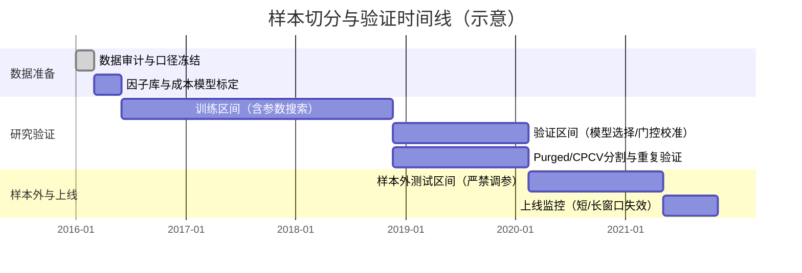

# 基于全球学术与行业证据的股票量化策略系统优化研究报告

## 执行摘要

你的程序从“单策略”进化为“分层策略系统”：涵盖股票池/特征构建、日度横截面评分、入场/仓位/再平衡/出场、执行现实约束（涨跌停、参与率、整手）、以及带有 Walk-forward、滚动稳定性、参数稳定区、PBO/DSR 等闸门的治理框架。fileciteturn0file0 citeturn0search2turn3search3turn6search3turn12search2  
这意味着“工程骨架”已经具备了学术界与一线资管更看重的两种能力：可执行性建模与过拟合防御。fileciteturn0file0 citeturn0search3turn4search3turn6search3turn3search0  
在未获得你的完整代码与回测结果前，最有把握、且投入产出比最高的优化路径是：先解决“因子定义与组合方式的统计一致性 + 交易成本标定 + 组合构建对成本/风险的内生化”，再考虑引入更复杂的机器学习模型。citeturn4search3turn5search2turn3search1turn0search3turn9search0  

下面是一份“可执行、按优先级排序”的改进清单（同时标注哪些结论可直接来自文献、哪些必须依赖你的代码/数据回测验证）：

| 优先级 | 改进项（可执行产物） | 关键原因（文献证据） | 依赖未指定信息 | 是否必须回测验证 |
|---|---|---|---|---|
| 高 | **数据与回测正确性审计**：全链路“时间戳一致性/复权/停牌/涨跌停/T+1/幸存者偏差”单元测试 + 抽样对账报表 | A股制度（T+1、涨跌停、创业板/科创板限制）会显著改变可成交集合与收益分布，若回测处理不严谨会系统性偏乐观。citeturn2search5turn2search2turn1search0turn1search1turn1search5 | 数据源质量、复权口径、成交撮合假设 | **是**（但属于“正确性验证”而非策略优劣） |
| 高 | **因子工程标准化**：winsorize/去极值、横截面标准化、行业/规模/β 中性化（可开关）+ 因子相关性与拥挤度诊断报表 | 多因子风险模型与行业实践强调行业/风格暴露可解释大部分共振；若不做中性化，策略可能只是“偏行业/偏小盘/偏高波动”。citeturn6search0turn6search4turn6search11turn12search0 | 是否有行业分类与风格暴露数据；是否允许偏离基准行业暴露 | **是**（对收益、回撤、换手都可能改变） |
| 高 | **成本模型标定与成本敏感再平衡**：把显性费税拆细到“印花税+经手费+证管费+过户费+佣金”，并用参与率/流动性对冲击成本做回归标定；在组合优化中加入换手惩罚/No-Trade Region | 交易成本与冲击成本对短周期策略高度敏感；最优动态调仓在有成本时应“向目标仓位提前但不一次到位”。citeturn10search1turn11search10turn0search3turn4search3turn9search2turn9search0 | 资金规模、下单方式、允许的成交参与率、调仓频率 | **是**（且需用真实/仿真成交假设） |
| 中 | **组合构建升级**：从“等权+上限”到“风险预算/HRP/（可选）均值-方差+收缩协方差 + 行业/单票/流动性约束” | 样本协方差对优化极不稳定，收缩估计与层次化风险预算可改善样本外稳健性；这是行业落地常用路线。citeturn5search2turn15search1turn6search2turn5search8 | 是否允许使用基准约束（tracking error）、行业偏离上限、最大持仓数 | **是** |
| 中 | **动量崩盘与波动管理模块（与你现有 momentum_crash 形成闭环）**：对“市场下跌后反弹+高波动”状态进行更细分的风险预算/信号缩放 | 动量存在“崩盘风险”，且与市场状态相关；波动管理能显著改变尾部风险结构。citeturn13search0turn14search4turn14search5 | 你的策略是否本质偏动量/趋势；指数过滤口径 | **是** |
| 中-低 | **机器学习选股（循证渐进）**：从线性/岭回归 → 树模型（GBDT）→（可选）神经网络；严格使用 Purged/CPCV，防止标签重叠泄露 | 机器学习在高维特征下可提升预测与组合表现，但最常见失败来自信息泄露与过拟合。citeturn3search1turn0search2turn3search3turn15search8 | 特征库规模、样本长度、算力、是否有财务报表与替代数据 | **是**（且必须做多重检验校正） |
| 低 | **因子库扩展（A股适配版）**：系统性引入“盈利/投资/质量/流动性/分红”并做 A股行为差异对比 | 文献显示盈利与投资因子能解释大量异常；A股市场因子行为与海外不同，需要本地校准。citeturn4search2turn4search1turn7search2turn7search10turn7search13 | 是否能获取高质量基本面与分红数据 | **是** |

**重要结论的“可直接从文献得出 vs 必须基于你的代码/数据验证”划分原则**：  
因子/组合/成本/回测方法的**方向性原则**（例如“要做中性化”“要做多重检验校正”“成本敏感调仓优于硬再平衡”）可以直接依据文献采纳。citeturn6search0turn6search3turn4search3turn0search3turn3search0  
任何关于“收益提升多少/回撤降低多少/参数应取几”的**量化结论**都必须在你的数据、交易频率、资金规模、约束条件下回测验证，并用抗过拟合统计检验确认。citeturn0search2turn3search3turn6search3turn12search2  

## 现有策略系统复盘与待验证点

### 系统结构与已具备的“行业级能力”

从你提供的策略全景看，系统包含：  
股票池（静态与可选的月度动态）、多数据源 fallback、日度横截面评分（趋势/动量、波动惩罚、成交活跃、事件加分、月线状态）、可开关的 Alpha 增强因子、候选过滤（可交易性、市值/流动性、行业分散、相关性拥挤控制、板块权重上限）、多路径入场与分层开仓、指数/市场状态门控、仓位上限动态调节、再平衡死区、复合卖出规则、执行现实约束（涨跌停、参与率、整手）、以及治理闸门（walk-forward、滚动窗口、稳定区扫描、PBO/DSR、失效监控 → trade_gate）。fileciteturn0file0  

这些模块与学术/行业共识对齐的点主要有三类：  
一是把“交易不可得性”显式纳入回测（涨跌停、参与率、整手），这对 A股尤为关键。fileciteturn0file0 citeturn1search1turn2search2turn1search0  
二是将“策略选择偏差/过拟合”纳入治理（PBO/DSR、walk-forward、稳定区），与主流的回测过拟合研究方向一致。fileciteturn0file0 citeturn0search2turn3search3turn6search3turn12search2  
三是通过“再平衡死区/仓位上限/风险门控”在工程上为成本与风险留出落地接口。fileciteturn0file0 citeturn4search3turn6search2  

### 目前最可能限制收益质量的“结构性短板”（需要代码/数据验证）

以下判断是基于你文档描述的“可能性诊断”，不是结论；都需要结合代码实现细节与回测分解（归因/成交/费用/暴露）验证：fileciteturn0file0  

**因子层的统计一致性风险**：你目前的评分由多类技术/事件因子叠加，并且 Alpha 增强使用预设权重。若缺少统一的横截面标准化、行业/规模中性化与相关性结构控制（尽管你已有 max_pairwise_corr 过滤），最终组合可能仍然隐含“行业/小盘/高换手”暴露。fileciteturn0file0 citeturn6search0turn6search4turn4search1  

**成本模型可能“方向正确但参数未标定”**：你已将费用与冲击成本写入执行层，但若成本参数（cost_bps、slippage、impact 指数、参与率限制）未用真实费率与市场冲击数据标定，策略在不同资金规模/流动性环境下的稳健性会被高估或低估。fileciteturn0file0 citeturn10search1turn11search10turn0search3turn9search2turn4search3  

**出场规则之间存在潜在“策略自我抵消”**：你同时使用硬止损、ATR、trailing、MA 止损、时间止损、失败止损、排名退出等多规则。若参数组合未经过冲突分析（例如 “failure_stop 过早触发” 与 “趋势持有” 逻辑冲突），可能把动量/趋势优势削弱为“高换手+高交易摩擦”。fileciteturn0file0 citeturn13search0turn14search4turn4search3  

**股票池与数据偏差风险**：你已有动态 watchlist 选项来降低静态池幸存者偏差，但是否真正覆盖退市样本、ST/停牌、以及是否使用一致复权口径，需要在数据层做审计与缺失机制分析。fileciteturn0file0 citeturn7search2turn2search5turn1search1  

### 未指定信息对优化建议的影响范围（必须显式说明）

你未提供资金规模、交易频率、持仓上限、是否允许做空/衍生品等。它们会直接决定：  
成本敏感调仓强度、参与率上限是否会成为容量瓶颈、是否能用多空中性来做因子纯化/对冲、以及某些短周期反转因子是否可行。citeturn0search3turn9search2turn6search0turn11search10  
因此，本报告会把建议分成“方向性可直接采纳”与“参数/收益效果必须在你约束下回测验证”。citeturn0search2turn3search3turn6search3  

## 文献综述

本节按主题梳理与你系统最相关的全球学术与行业证据，并给出“可迁移到你策略的落地含义”。（表格中“适用性”主要讨论对 A股与对你当前“日度横截面+执行约束+治理闸门”框架的契合度。）fileciteturn0file0  

### 选股因子与因子库扩张

跨市场的研究普遍表明：动量、价值、盈利/质量、投资、低波动、流动性相关特征在长期样本中具有解释力或可交易性，但强度与可交易性会受到市场结构、做空约束、交易成本与样本选择的显著影响。citeturn0search1turn4search2turn4search1turn9search0turn7search2turn3search0  

尤其需要强调三点“从文献直接可得的约束”：

因子显著性门槛需要考虑多重检验与“因子动物园”，不能再用传统 t>2 的直觉阈值。citeturn8search6turn3search0turn0search2turn3search3  
大量异常收益在样本外会衰减，尤其在被公开后更明显，因此因子库扩张必须配合严格的样本外验证与稳健性设计。citeturn8search7turn3search0turn0search2  
动量类策略有尾部崩盘风险，且与市场状态相关；这与你系统已有的“动量崩盘保护/指数门控”方向一致，但更需要精确定义状态变量与缩放机制。citeturn13search0turn14search4turn14search5  

### 因子组合、风险模型与组合构建

从组合理论到行业实务，主线共识是：  
当你能稳定预测横截面超额收益（IC）时，组合构建的核心任务就从“找最优权重”转为“把预测转化为在约束下的稳定暴露”，包括：行业/风格暴露控制、协方差稳定估计、以及在交易成本存在下的部分调仓/No-Trade Region。citeturn12search0turn6search0turn5search2turn4search3  

对你系统最可落地的三个学术-行业交叉结论：

多因子风险模型强调国家/行业/风格因子对收益共振的解释力；因此你的“行业分散、板块上限、相关性控制”应进一步升级为“显式暴露约束（exposure constraints）+ 归因报表”。citeturn6search0turn6search11turn6search4  
均值-方差优化对样本协方差极敏感，收缩协方差能显著缓解估计误差；若你不想强依赖收益预测，也可以用风险预算/层次化风险分配（如 HRP）提升样本外稳健性。citeturn5search2turn15search1turn5search8  
尾部风险度量（如 CVaR）可用于把“涨跌停+T+1 导致的不可卖出风险”以情景方式纳入优化目标或约束（尤其适合 A股制度环境）。citeturn6search2turn2search5turn1search5  

### 机器学习在选股与因子选择中的作用边界

机器学习在“高维特征 → 预测预期收益或排序”的资产定价问题中，树模型与神经网络往往能捕捉非线性交互并取得显著经济收益，但其成功高度依赖：严格的样本外验证、避免信息泄露的交叉验证、以及对过拟合与选择偏差的校正。citeturn3search1turn15search8turn0search2turn3search3  

与“因子动物园”相对应，因子选择与模型选择本身也需要统计纪律：系统化检验新因子增量解释力、并控制模型选择错误，是因子研究走向“可复现与可交易”的关键。citeturn3search0turn8search6turn4search1  

对你当前框架的直接启示是：  
机器学习不应作为第一步替代现有评分系统，而应先作为“校准器/二阶段模型”：用它学习你现有因子在不同市场状态下的非线性组合权重，或用于识别失效状态与拥挤状态。citeturn3search1turn13search0turn8search7  

### 交易成本、滑点与冲击成本建模

交易成本研究清楚表明：显性费用只是下限，市场冲击与流动性（尤其是参与率相关的非线性冲击）往往是决定策略容量与真实可行性的核心。citeturn0search3turn9search2turn9search0turn4search3  

“最优执行/最优调仓”文献与实践共同结论：在存在交易成本与冲击成本时，最优策略通常不会一步到位调到目标仓位，而是以成本与风险权衡决定调仓速度，并会形成某种 No-Trade Region。citeturn0search3turn4search3turn6search2  

这与你系统已有的“再平衡死区”在思想上同源，但最佳实践是把“死区阈值”从固定参数升级为：由波动、流动性、预期收益强度与费用结构共同决定的动态阈值。citeturn4search3turn9search0turn6search2  

### 回测过拟合、数据挖掘偏差与统计显著性

把回测当作“模型选择”问题时，传统 hold-out 往往不足以约束过拟合；需要用专门面向金融回测的过拟合概率评估、以及对 Sharpe 的选择偏差校正。citeturn0search2turn3search3  

同时，面对多策略/多参数/多因子同时搜索，必须使用数据挖掘校正检验（如 reality check / SPA）与更高的显著性门槛，否则在同一数据上重复试验会系统性夸大显著性。citeturn6search3turn12search2turn8search6  

你系统中已经出现 PBO/DSR，这非常接近上述研究路线；接下来最关键的是保证：  
这些统计量的输入收益序列是“包含成交约束与成本后的净收益”，且样本切分遵守时间顺序并避免标签重叠泄露。fileciteturn0file0 citeturn0search2turn3search3turn15search8  

### A股市场制度与“可交易性”的一阶影响

A股的关键制度性约束包括：  
T+1 的“当日买入不可当日卖出”对收益结构（尤其隔夜与盘中）有可观影响。citeturn2search5turn1search14  
涨跌停与不同板块不同限制（主板 10%、ST 5%、创业板与科创板 20%，且新股上市前若干日不设涨跌幅）会显著改变策略的可成交性与尾部风险。citeturn1search1turn2search2turn1search0  
融资融券（尤其融券）覆盖标的与规则限制，使得很多“学术上的多空因子”在真实 A股环境下更可能以“多头选股+风险控制”的形态落地。citeturn1search3turn2search3  

近年来监管与交易基础设施变化也可能影响量化交易生态（尤其极速/共址类频率优势），这提醒你：如果未来策略频率上移或执行更依赖盘口数据，需要把监管变化纳入模型风险评估。citeturn1news47  

### 关键文献与行业报告对比表

| 主题 | 代表文献/报告（标题-年份） | 数据集/市场 | 方法/结论要点 | 对你系统的适用性（落地含义） |
|---|---|---|---|---|
| 经典因子 | Common risk factors…-1993 | 美国股票+债券 | 多因子框架解释共同收益变动，为“风格/行业暴露”奠定模型化基础。citeturn0search4 | 用作你组合风险归因与暴露约束的基线思想；不要求照搬因子定义。 |
| 动量 | Returns to Buying Winners…-1993 | 美国股票 | 横截面动量具有统计与经济显著性。citeturn0search1 | 支持你现有动量/趋势主线；但必须计入成本与制度限制。 |
| 动量尾部风险 | Momentum crashes-2016 | 多资产/股票 | 动量在特定“恐慌后反弹”状态可能崩盘且部分可预测。citeturn13search0 | 为你“动量崩盘保护/状态门控”提供可检验的状态变量设计方向。 |
| 动量波动管理 | Momentum has its moments-2015；Volatility-Managed Portfolios-2017（工作论文/发表版） | 股票因子 | 用波动缩放等方法可改善动量尾部风险与 Sharpe。citeturn14search4turn14search5 | 可将你当前 cap/门控升级为“信号与仓位的波动目标化”。 |
| 价值 | Contrarian Investment…-1994 | 美国股票 | 价值策略可能来自投资者错误定价而非更高风险。citeturn14search3 | 支持你“value_proxy”方向；但 A股需本地检验与数据质量保障。 |
| 盈利/质量 | The Gross Profitability Premium-2013；Quality Minus Junk-2013 | 美国股票/多市场 | 盈利/质量对横截面收益有解释力。citeturn4search2turn8search1 | 支持你“alpha_quality/机构持仓过滤”；若缺财务数据需用代理变量并验证。 |
| 投资因子 | Digesting Anomalies…-2015（q 因子） | 美国股票 | 投资与盈利因子可解释大量异常，且提醒微盘股会夸大异常。citeturn4search1 | 你的市值/流动性过滤与“避免微盘”方向一致；可加入“投资/扩张”维度。 |
| 因子动物园 | Taming the Factor Zoo-2020 | 美国股票特征库 | 系统化比较新因子增量贡献并控制选择错误。citeturn3search0 | 直接指导你的“alpha_enhancement 因子库扩张”的检验流程。 |
| 多重检验门槛 | …and the Cross-Section of Expected Returns-2016 | 文献汇总 | 因多重检验，新因子需要更高显著性门槛。citeturn8search6 | 直接写入你的治理 gate：对新增因子提高上架门槛。 |
| 公开后衰减 | Does Academic Research Destroy…-2016 | 82 个特征组合 | 异常收益在公开后平均衰减。citeturn8search7 | 提醒你做“后验拟合”的风险；强调样本外与滚动监控的重要性。 |
| ML 选股 | Empirical Asset Pricing via ML-2020 | 美国股票大特征集 | 树模型/NN 捕捉非线性交互提升预测与组合表现。citeturn3search1 | 建议作为二阶段权重学习器；必须用金融式 CV 防泄露。 |
| 金融式 CV | 金融机器学习书（Purged/CPCV 章节）-2018 | 方法论 | 标签重叠会导致信息泄露，需 Purged/CPCV 与 embargo。citeturn15search5turn15search8 | 直接嵌入你的 walk-forward 与参数搜索流程，替代或补强传统 CV。 |
| 回测过拟合 | Probability of Backtest Overfitting-2015；Deflated Sharpe Ratio-2014 | 方法论 | 量化选择偏差与 Sharpe 膨胀；给出 DSR/PSR 等。citeturn0search2turn3search3 | 你已使用 PBO/DSR，建议把它与“净收益（含成本）+CPCV”耦合。 |
| 数据挖掘检验 | Reality Check-2000；SPA-2005 | 方法论 | 多模型比较下的显著性校正。citeturn6search3turn12search2 | 可作为“因子/参数上架”统计闸门的补充。 |
| 流动性溢价 | Illiquidity and stock returns-2002 | 美国股票 | 用量价构造的流动性指标与收益相关。citeturn9search0 | 为你的流动性过滤与冲击成本回归提供特征定义候选。 |
| 最优执行 | Optimal Execution…-2000 | 理论+模型 | 市场冲击分解（永久/暂时）与风险-成本权衡。citeturn0search3 | 你的 impact(participation^exponent) 可升级为带标定的结构化模型。 |
| 动态调仓含成本 | Dynamic Trading with Predictable Returns and Transaction Costs-2013 | 理论 | 成本存在时应部分调仓/向前看，形成 no-trade region。citeturn4search3 | 直接对应你“rebalance_band”的理论升级版（动态化）。 |
| A股因子模型比较 | Factor models for Chinese A-shares-2024 | 中国 A股（偏大盘/流动样本） | 美国因子模型在 A股有用但需改造，本地化模型可能更优。citeturn7search2 | 明确“不能照搬海外因子权重/定义”，需要 A股本地检验。 |
| T+1 影响 | Overnight return puzzle & T+1 rule-2020 | 中国 A股 | T+1 的非对称限制会影响收益结构。citeturn2search5 | 回测撮合需符合 T+1；并需要拆分隔夜/盘中贡献做归因。 |
| 涨跌停改革与效应 | ChiNext 10%→20% 研究-2023 | 创业板 | 价格限制影响价格发现、波动溢出、磁吸效应等。citeturn1search5 | 强化你对涨跌停“不可成交风险”的情景化评估与约束建模。 |
| 行业报告（A股因子） | MSCI China A-share factor 报告；S&P DJI 报告；CAIA 报告 | 中国 A股 | A股因子行为与发达市场存在差异；质量/价值等可能更稳定。citeturn7search10turn7search13turn7search3 | 作为“因子上架优先级”的外部证据；仍需你数据回测确认。 |

## 针对你策略的具体优化建议

本节以你的现有框架为前提（不要求推倒重来），把建议拆成：因子/特征、模型与组合、风控与治理、交易执行与成本四条主线，并对每条建议标注“是否需要回测验证”与“依赖哪些未指定信息”。fileciteturn0file0  

### 因子与特征工程优化

#### 把“评分系统”升级为“可解释的因子管线”（先统一口径，再谈新增因子）

你当前的基础分与 alpha_enhancement 都是“横截面评分→排名→持仓”。fileciteturn0file0  
要提升稳健性，第一步不是加更多因子，而是把每个因子变成可审计的标准形态：

对每个交易日横截面：去极值（winsorize）→ 标准化（z-score）→（可选）行业/规模中性化 → 缺失处理规则明确化。这样做能让因子权重具有可比性，并减少“某个因子仅因尺度大而主导评分”的隐性问题。citeturn6search0turn6search4turn12search0  
其中“行业/风格中性化”是否启用，取决于你是否希望策略显著偏离行业暴露；行业实践通常会在追求纯因子收益时做中性化，在追求主题/趋势时少做或只做部分约束。citeturn6search0turn6search11turn12search19  

**需要你代码/数据验证的点**：你是否已经在 precompute_daily_universe 或后续步骤做了上述标准化/中性化与缺失处理；若做了，口径是否一致、是否存在未来函数或复权前瞻。fileciteturn0file0  

#### 因子改造与增补：优先补齐“盈利/投资/流动性/分红”，并把动量做“抗崩盘缩放”

你现有因子更偏趋势/动量/事件驱动（ret_20d/ret_60d、突破、涨停事件、TDX 强、主力强等）。fileciteturn0file0 citeturn0search1turn13search0  
文献与行业报告提示：在 A股，价值、质量等基本面因子可能更稳定，而因子行为存在本地差异，需要本地化校准。citeturn7search10turn7search13turn7search2  

建议按“最小可用数据集”分两层推进：

**层一：仅靠量价也能增强的因子（更容易落地）**  
加入流动性因子（如 Amihud 型指标或成交额倒数类代理），同时把它用于两处：  
一是作为“惩罚项”抑制高冲击成本标的；二是在冲击成本回归里作为解释变量。citeturn9search0turn0search3turn9search2  
对动量因子做波动缩放：对每只股票的动量信号除以自身波动或用风险目标化权重，匹配“动量风险可预测且可管理”的研究结论。citeturn14search4turn14search5turn13search0  

**层二：引入基本面后的“正交因子补齐”（更可能提高真实性）**  
补齐盈利/质量：例如利润率、毛利率到资产比、ROE、经营现金流等；相关研究显示盈利/质量在横截面具有解释力。citeturn4search2turn8search1turn6search0  
补齐投资/扩张：资产增长、资本开支、营收增长质量等，能与盈利一起解释大量异常并减少“纯价格信号拥挤”。citeturn4search1turn7search2  
分红/回购与股东回报相关特征在 A股环境中近年更受关注（行业研究与新闻均反映制度推动），但仍需你本地回测确认其可交易性与拥挤风险。citeturn7news45turn7search13turn7search10  

**必须回测验证的点**：  
这些因子在你的股票池、过滤规则、调仓频率、涨跌停可成交约束下，是否仍然保持正的净收益与稳定的 IC。citeturn8search7turn3search0turn0search2  

#### 用“增量解释力”而非“直觉权重”管理 alpha_enhancement 因子库

你当前 alpha_enhancement 已经引入“行业相对强度、资金流持续性、质量、短期反转、换手反转、价值代理”等，并通过配置权重叠加。fileciteturn0file0  
文献对“因子动物园”的直接应对，是把“新因子是否真的增量贡献”变成一个制度化检验：在高维候选因子集合中评估各因子边际贡献，并控制模型选择错误与多重检验偏差。citeturn3search0turn8search6  

落地做法是：  
把每个候选因子视为“能否在已有因子解释之外提供增量预测”的假设检验对象；通过嵌套样本外框架与多重检验校正，决定“上架/降权/下架”，而不是仅凭单因子回测或主观权重。citeturn3search0turn6search3turn12search2  

### 模型选择与组合构建优化

#### 从“等权+上限”升级为“风险预算/优化器”，并把行业与风格暴露显式写入约束

你当前单票权重以等权为主，并叠加单票上限、行业分散、相关性拥挤控制、板块总仓位上限等。fileciteturn0file0  
这是一个良好的“工程底座”，但仍然属于启发式组合构建。

更接近行业主流的升级路径是：

先建立一个因子/行业暴露视图（可以先用行业 dummy + 主要风格指标做代理），然后在组合层显式约束：  
行业偏离上限、风格暴露上限、单票权重、换手惩罚、流动性/参与率约束，并以最小方差/风险预算/（可选）CVaR 作为风险目标。citeturn6search0turn6search11turn6search2turn11search10  

在估计协方差时，优先使用收缩估计来缓解样本误差；这是均值-方差或任何二次型优化的关键稳定器。citeturn5search2turn5search8  

若你不希望强依赖收益预测（担心预期收益噪声太大），可以用 HRP/风险预算作为中间形态：它更依赖相关结构而非收益预测，并在业界常被用作稳健替代。citeturn15search1turn5search2  

**必须回测验证的点**：优化器引入后通常会改变换手、拥挤与尾部风险；在 A股涨跌停环境下，优化器更需要“不可成交情景”压力测试，否则可能在极端日出现理论上要卖却卖不掉的问题。citeturn1search5turn2search5turn6search2  

#### 把“再平衡死区”升级为“成本敏感的动态 No-Trade Region”

你已有 rebalance_band 来避免小幅调仓，这是 No-Trade Region 的简化版本。fileciteturn0file0  
在交易成本研究中，含成本的最优动态调仓往往表现为：根据预期收益的均值回复速度、风险、以及交易成本决定调仓速度，而不是固定阈值。citeturn4search3turn0search3  

建议的可执行升级：  
将 rebalance_band 变为动态：  
阈值 ∝（预估单边交易成本 + 冲击成本）/（信号强度 × 预期持有期）。  
这会自动让：高成本/低流动标的更少动，强信号/高确定性标的更积极调。citeturn9search2turn0search3turn4search3  

这一步高度依赖你的资金规模与调仓频率，但方向性结论可直接采纳。citeturn0search3turn11search10  

### 风险控制与治理框架优化

#### 把“市场状态门控”与“动量崩盘防护”从启发式升级为“可检验的状态变量体系”

你系统已具备指数过滤、牛熊状态仓位上限、动量崩盘保护、回撤预刹车等。fileciteturn0file0  
动量崩盘研究指出：崩盘更可能发生在“市场下跌后反弹、波动高”的状态，并在一定程度上可预测。citeturn13search0turn14search4  

建议你把状态变量显式化并做“状态条件回测分解”：

至少包含三类状态：  
市场趋势（指数均线/回撤）、市场波动（指数实现波动/隐含波动若可得）、流动性状态（市场成交额/冲击代理）。citeturn13search0turn14search5turn9search0  
然后让仓位上限、入场阈值、以及动量/趋势信号的权重缩放都由这些状态驱动，并用 walk-forward 验证其稳定性。citeturn0search2turn14search5turn12search0  

**必须回测验证的点**：状态变量与门控阈值非常容易过拟合；应纳入你现有的稳定区扫描、PBO/DSR、以及数据挖掘检验。citeturn0search2turn3search3turn6search3turn12search2  

#### 把“因子动物园纪律”写入质量闸门（quality_gate）与因子上架流程

你已有 PBO/DSR、rolling 稳定性、双窗口失效监控等治理。fileciteturn0file0  
建议补齐两块“文献明确指出的重要缺口”：  
一是多重检验门槛（新因子 t 值/信息比率的更高门槛或等价校正）；citeturn8search6turn3search0  
二是 Reality Check / SPA 这类“多模型比较下的显著性校正”，可作为参数扫描后选择胜者的最终统计闸门。citeturn6search3turn12search2  

### 交易成本估计与执行现实增强

#### 显性费税拆解到可核对口径，并与市场制度绑定

A股显性成本至少应包含：  
卖出方证券交易印花税（2023-08-28 起减半征收为 0.05% 的政策依据需在你的回测口径中固定记录）。citeturn10search1  
经手费与证管费、过户费等可在交易所/清算体系的公开口径中核对（以互联互通费用表为例，经手费 0.00341%、证管费 0.002%、过户费 0.001%）。citeturn11search10  

你当前用 cost_bps * turnover 的方式可作为第一版，但建议升级为“组件化成本”，并在回测报告中输出“费用拆分归因”（印花税、经手费、冲击等各占比）。citeturn0search3turn11search10turn10search1  

**依赖未指定信息**：佣金水平与是否包含规费常随券商与账户而变；若你未来要实盘，佣金与是否有返佣将改变最优换手。citeturn11search10turn10search1  

#### 冲击成本标定：从“设定参数”到“参与率-冲击回归”

最优执行文献通常把冲击成本与参与率、波动、流动性联系起来，并且冲击对交易量呈非线性（常见为凹函数/平方根规律）。citeturn0search3turn9search2turn9search0  
你可以在日频层面做一个可执行的标定框架：  
用（买卖方向 × 当日成交量占比）解释“成交价相对 VWAP/收盘价”的偏移（若无逐笔数据，可用更粗糙的代理，如开盘执行的滑点分布）。citeturn9search1turn0search3turn9search2  

**必须回测验证的点**：标定需要与你的下单时点一致（你当前 paper trading 是“下一交易日开盘执行”）；开盘冲击与日内其他时段不同，参数不可混用。fileciteturn0file0 citeturn0search3turn9search2  

## 可执行回测与实验设计

本节给出一套可以直接落地到你现有 run_backtest_strategy_v3.py / strategy_process_pipeline 治理管线的实验设计，目标是：逐步定位“收益来自哪里、成本吃掉哪里、稳定性是否真实”，并在每一步减少过拟合空间。fileciteturn0file0  

### 数据需求与样本构造

最低可用数据（你当前量价体系即可启动）：日频 OHLCV、复权因子、停牌/涨跌停标记、ST 标记、行业分类（可先用交易所/指数体系或第三方公开分类）、流通市值与成交额。citeturn1search1turn2search2turn7search2turn11search10  
增强数据（用于质量/盈利/投资/分红等）：财务报表（季度/年报）、分红回购公告与实施数据、机构持仓（若可得）。citeturn4search2turn8search1turn7search10turn7news45  

样本切分原则：  
必须按时间顺序，避免未来信息泄露；若标签跨期（例如预测未来 20 日收益），训练集必须 purge 掉与测试标签窗口重叠的样本，并设置 embargo。citeturn15search5turn15search8  

### 基准、指标与显著性检验

基准建议至少包含三类：  
同股票池下的“仅过滤不做 alpha 增强”的基准；同调仓频率下的简单动量/反转基准；以及一个可交易指数/ETF 基准（用于可投资性比较）。citeturn0search1turn13search7turn6search0  

评价指标建议分层：  
组合层（年化收益、波动、Sharpe、最大回撤、Calmar、尾部风险如 CVaR、换手率、容量 proxy）；citeturn6search2turn12search0turn9search0  
信号层（IC/RankIC、ICIR、分组收益、持有期收益曲线、因子与成本/流动性的相关性）；citeturn12search0turn6search0turn3search0  
稳定性层（walk-forward、滚动窗口、参数稳定区、短/长窗口失效率）。citeturn0search2turn3search3  

显著性与抗数据挖掘：  
对多参数/多策略择优，使用 DSR/PBO 评估选择偏差，并用 Reality Check / SPA 做“多模型比较校正”。citeturn0search2turn3search3turn6search3turn12search2  
对新增因子或模型，采用更高显著性门槛或等价的多重检验校正框架。citeturn8search6turn3search0  

### 实验步骤与优先级表（可直接照抄成你的研发看板）

| 步骤 | 目标 | 输入 | 输出产物 | 主要风险控制 | 优先级 |
|---|---|---|---|---|---|
| 回测正确性审计 | 排除未来函数/复权/撮合错误 | 现有回测脚本 + 抽样交易日 | “撮合对账报告”：每笔交易是否满足 T+1/涨跌停/停牌；复权前后收益一致性 | A股制度约束核验（T+1、涨跌停分板块）citeturn2search5turn2search2turn1search0turn1search1 | 高 |
| 费用拆分与主成分归因 | 明确利润是否被成本吃掉 | 交易记录+费率表 | 成本分解（印花税/经手费/证管费/过户费/冲击）与净值差异 | 采用官方费税口径冻结版本citeturn10search1turn11search10 | 高 |
| 因子流水线标准化 | 提升可解释性与可比性 | 因子列表+行业分类 | 因子 QC 报告：分布、极值、缺失、相关性、拥挤度 | 风险模型/行业暴露对齐citeturn6search0turn6search11 | 高 |
| 因子增量检验 | 防止因子动物园 | 候选因子库 | 因子上架清单：增量贡献、稳健性、样本外衰减 | 模型选择错误与多重检验校正citeturn3search0turn8search6 | 高 |
| 成本敏感再平衡 | 降换手、提净收益 | 成本模型+信号强度 | 动态 rebalance_band 或部分调仓策略 | 交易成本与可预测收益共同决定调仓强度citeturn4search3turn0search3 | 高 |
| 组合构建升级 | 降回撤/降拥挤 | 协方差估计+约束 | 风险预算/HRP/（可选）MVO + 收缩协方差 | 协方差估计误差控制citeturn5search2turn15search1 | 中 |
| 状态变量与门控校准 | 降动量崩盘尾风险 | 指数趋势/波动/流动性状态 | 状态条件绩效报告+门控规则 | 防止状态阈值过拟合citeturn13search0turn0search2 | 中 |
| ML 二阶段融合 | 学习非线性权重/交互 | 因子矩阵+标签 | 二阶段模型（排序/收益预测）+解释性分析 | Purged/CPCV 与 embargo 防泄露citeturn3search1turn15search8 | 中-低 |

### 可复现的流程图与时间线示意

#### 因子构建与交易决策总流程（建议直接映射到你现有脚本入口）

```mermaid
flowchart TD
  A[数据更新与复权对齐] --> B[股票池生成<br/>静态/动态 + 可交易性]
  B --> C[因子计算<br/>量价/事件/基本面]
  C --> D[因子QC与标准化<br/>去极值/标准化/缺失处理]
  D --> E[可选：中性化<br/>行业/规模/β]
  E --> F[信号合成<br/>固定权重或IC加权/二阶段模型]
  F --> G[候选过滤<br/>流动性/市值/行业分散/相关性拥挤]
  G --> H[市场状态门控<br/>指数过滤/回撤刹车/动量崩盘保护]
  H --> I[组合构建<br/>等权→风险预算/HRP/MVO(含成本)]
  I --> J[生成目标权重]
  J --> K[成本敏感调仓<br/>动态No-Trade Region/参与率约束]
  K --> L[执行仿真<br/>涨跌停/T+1/整手/滑点冲击]
  L --> M[净值与归因输出<br/>收益/成本/暴露/换手]
  M --> N[治理闸门<br/>WF/滚动/稳定区/PBO-DSR/RC-SPA]
  N --> O[trade_gate动作<br/>normal/reduce/stop]
```

#### 回测时间线（walk-forward + 研究/生产分层）



### 可复现伪代码：成本敏感的动态调仓（替代固定 rebalance_band）

```text
输入：
  当前持仓 w_t, 目标持仓 w*_t
  预期收益信号 s_i,t（标准化后）
  预估单边显性成本 c_explicit（含印花税等）
  预估冲击成本 c_impact_i,t = k * (participation_i,t)^alpha * volatility_i,t
  预期持有期 H（由调仓频率/退出规则决定）
  风险厌恶/换手惩罚参数 λ

对每只股票 i：
  delta_i = w*_i,t - w_i,t
  cost_i = c_explicit + c_impact_i,t
  benefit_i ≈ |s_i,t| * H    # 用作“信号强度×持有期”的代理
  threshold_i = λ * cost_i / max(benefit_i, ε)

  若 |delta_i| < threshold_i：
      trade_i = 0
  否则：
      trade_i = clip(delta_i, -max_trade_i, +max_trade_i)   # max_trade_i 由参与率/涨跌停/T+1约束决定

执行顺序：
  先卖后买；若触发跌停/停牌/T+1导致不可卖出，则记录“不可执行缺口”，并在风险模块中计入情景损失。
```

## 风险与局限性评估

### A股制度性风险与交易不可得性

A股的 T+1 非对称限制会改变隔夜与盘中收益结构，并可能导致“锁定折价/行为扭曲”；你的回测与归因需要显式拆分隔夜/盘中贡献才能验证策略是否吃到制度性噪声还是可持续风险溢价。citeturn2search5turn1search14  
涨跌停制度与不同板块差异（主板 10%、ST 5%、创业板/科创板 20%、新股上市初期不设涨跌幅）使得尾部风险不仅来自价格波动，也来自“无法成交”。citeturn1search1turn2search2turn1search0  
因此，任何声称改善回撤/止损的规则，都必须在“卖出可能被跌停阻塞”的仿真成交模型下验证，否则存在系统性乐观偏差。citeturn1search5turn0search3  

### 数据偏差与数据源风险

多数据源 fallback 会提高可用性，但也可能带来口径不一致（复权、成交量修正、停牌缺失）；对因子研究而言，这类偏差会直接污染 IC、相关性结构与稳定性检验。fileciteturn0file0 citeturn3search0turn0search2  
静态股票池易引入幸存者偏差；你虽提供动态 watchlist 选项，但仍需确认样本包含退市、ST、长期停牌等极端情况，否则回撤与尾部风险会被低估。fileciteturn0file0 citeturn7search2turn1search1  

### 样本外失效与拥挤交易风险

因子与策略在公开后可能衰减；即使在海外文献中被验证的特征，在不同市场结构与做空约束下也会表现不同。citeturn8search7turn7search2turn7search10  
动量类策略的尾部风险、以及“高换手+高冲击”的容量瓶颈，在资金规模增大时往往比模型精度更先成为收益上限。citeturn13search0turn0search3turn9search2  

### 监管与市场结构变化风险

监管与交易基础设施变化可能改变部分交易优势来源（尤其是极速/共址/高频相关），即使你当前是日频系统，也应在未来频率上移或引入更细粒度执行时把此类变化纳入模型风险清单。citeturn1news47  

## 参考文献与官方数据源

下列条目以“原始论文/官方口径/顶级机构报告”为优先（均可通过对应引用链接获取或定位）。

学术与方法论文（因子、机器学习、过拟合与统计检验）：citeturn0search4turn0search1turn4search0turn4search2turn4search1turn13search0turn14search4turn3search0turn8search6turn8search7turn3search1turn15search5turn15search8turn0search2turn3search3turn6search3turn12search2turn9search0turn0search3turn4search3turn5search2turn6search2  

A股市场制度、规则与研究：  
- entity["organization","深圳证券交易所","stock exchange shenzhen, cn"] 交易规则（含 10% 与 ST 5% 涨跌幅限制等条款）。citeturn1search1  
- entity["organization","上海证券交易所","stock exchange shanghai, cn"] 交易机制说明（科创板 20% 涨跌幅限制及新股前若干日不设限制等）。citeturn1search0  
- 创业板 20% 涨跌幅限制规则说明（投资者教育口径）。citeturn2search2  
- T+1 制度效应（隔夜收益之谜与 T+1 机制解释）。citeturn2search5  
- 创业板涨跌停改革与价格限制有效性研究。citeturn1search5  

费用与税费官方口径：  
- entity["organization","财政部","gov finance ministry beijing, cn"] 与 entity["organization","国家税务总局","tax authority beijing, cn"]：证券交易印花税减半征收公告（2023-08-28 起）。citeturn10search1  
- entity["organization","香港交易及结算所有限公司","stock exchange hong kong, cn"]：互联互通 A股交易费用（含经手费、证管费、过户费等公开口径）。citeturn11search10  

行业报告与机构研究（A股因子差异与实践）：  
- entity["company","MSCI","index provider new york, us"]：China A-share 因子研究报告与因子指数方法学。citeturn7search10turn6search0  
- entity["organization","标普道琼斯指数","index provider new york, us"]：A股因子策略研究报告。citeturn7search13  
- entity["organization","CAIA协会","professional association amherst, us"]：A股因子投资综述。citeturn7search3